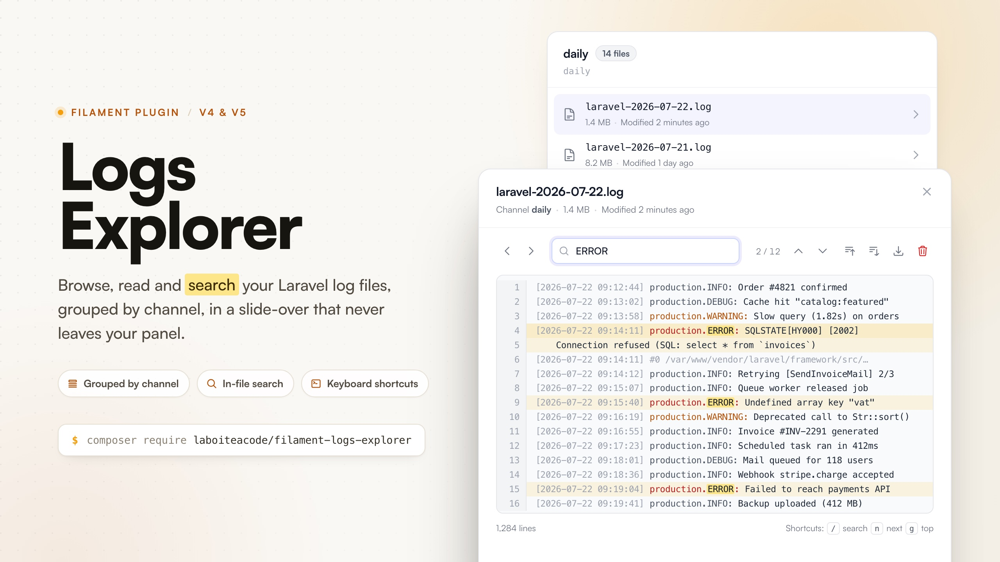

# Filament Logs Explorer

[](https://packagist.org/packages/laboiteacode/filament-logs-explorer)
[](https://github.com/la-boite-a-code/filament-logs-explorer/actions/workflows/run-tests.yml)
[](https://packagist.org/packages/laboiteacode/filament-logs-explorer)
[](LICENSE.md)

Read your Laravel log files without leaving your Filament panel. Files are
grouped by logging channel and open in a slide-over with in-file search, match
navigation and keyboard shortcuts.



## Features

- **Channel aware.** Log files are resolved from your `config/logging.php`,
  not from a hardcoded path: `single`, `daily`, `monolog` stream handlers, and
  the file based members of a `stack`.
- **Slide-over viewer.** In-file search with highlighting and match navigation,
  jump to start or end, move to the previous or next file without closing the
  slide-over, and download the raw file.
- **Keyboard driven.** `/` to search, `n` and `N` to walk through matches,
  `g` and `G` to jump to the start or the end of the file.
- **Safe on large files.** Files above a configurable size are truncated, and
  the viewer loads the end of the file first so the most recent entries are
  always the ones you see.
- **File deletion.** Delete a log file from the list or from the viewer, behind
  a confirmation dialog and its own authorization hook, independent of read
  access.
- **Configurable twice over.** Every option is available both in a published
  config file and through a fluent, per-panel plugin API.
- **Authorization built in.** A single `canAccess()` hook drives both the
  navigation item and the route.
- **Translated.** Ships with English, French and Spanish.

## Compatibility

| Package  | Supported versions |
| -------- | -------------- |
| PHP      | 8.2, 8.3, 8.4, 8.5 |
| Laravel  | 12, 13         |
| Filament | 4, 5           |

## Installation

Install the package with Composer:

```bash
composer require laboiteacode/filament-logs-explorer
```

Register the plugin on every panel where it should appear, usually in
`app/Providers/Filament/AdminPanelProvider.php`:

```php
use LaBoiteACode\FilamentLogsExplorer\FilamentLogsExplorerPlugin;

public function panel(Panel $panel): Panel
{
    return $panel
        // ...
        ->plugin(FilamentLogsExplorerPlugin::make());
}
```

That is the whole setup. A **Logs** entry appears in the navigation and lists
every file based channel the plugin can find.

### Assets

The viewer's CSS and JS are registered with Filament automatically. In
production, publish them like any other Filament asset:

```bash
php artisan filament:assets
```

### Publishing

All three publishable groups are optional:

```bash
# config/filament-logs-explorer.php
php artisan vendor:publish --tag="filament-logs-explorer-config"

# lang/vendor/filament-logs-explorer/{locale}/filament-logs-explorer.php
php artisan vendor:publish --tag="filament-logs-explorer-translations"

# resources/views/vendor/filament-logs-explorer/
php artisan vendor:publish --tag="filament-logs-explorer-views"
```

## Usage

### The Logs page

The page renders one collapsible section per channel, each showing that
channel's most recent files with their name, size and last modified date. A
**Refresh** action in the header re-scans the disk.

Clicking a file opens it in the viewer. Files the process cannot read are
listed but marked as unreadable, so a permission problem is visible instead of
silent.

### The viewer

| Action                            | How                                            |
| --------------------------------- | ---------------------------------------------- |
| Search in the file                | Type in the search box, matches are highlighted |
| Jump between matches              | The up and down buttons, or `n` and `N`         |
| Go to the start or end of the file | The two buttons, or `g` and `G`                |
| Open the previous or next file    | The `<` and `>` buttons, without closing the slide-over |
| Focus the search box              | `/`                                             |
| Download the raw file             | The download button                             |
| Delete the file                   | The trash button, after a confirmation          |

While the search box has focus, `Enter` moves to the next match, `Shift+Enter`
to the previous one, and `Escape` clears the search. The single letter
shortcuts are only active outside the search box, so typing `n` in a query does
what you expect.

### Large files

Files larger than `reader.max_bytes` (5 MB by default) are truncated. The
viewer loads the **end** of the file, which is where the most recent entries
are, and shows a banner explaining that the file was truncated and inviting the
user to download it in full. Set `reader.tail_when_exceeded` to `false` to load
the beginning instead.

## Configuration

Every option can be set **globally** in the published
`config/filament-logs-explorer.php`, or **per panel** through the fluent plugin
API. The fluent value always wins, which lets several panels in the same
application expose different subsets of the logs.

### Channels

By default the plugin auto-discovers every file based channel declared in
`config/logging.php`. Provide an explicit list to restrict and order them:

```php
// config/filament-logs-explorer.php
'channels' => ['daily', 'single'],  // empty array => auto-discover
'exclude_channels' => ['emergency'],
'expand_stacks' => true,            // expand "stack" channels into their members
'files_per_channel' => 15,
```

```php
FilamentLogsExplorerPlugin::make()
    ->channels(['daily', 'single'])
    ->excludeChannels(['emergency'])
    ->expandStacks()
    ->filesPerChannel(20);
```

### Untracked files

To also surface `*.log` files that are not attached to any channel, enable the
directory scan. Those files are grouped under their own section:

```php
'discover_untracked_files' => true,
'log_directory' => null,             // null => storage_path('logs')
'untracked_channel_label' => null,   // null => the translated label
```

```php
FilamentLogsExplorerPlugin::make()
    ->discoverUntrackedFiles(directory: storage_path('logs'));
```

### Navigation

```php
FilamentLogsExplorerPlugin::make()
    ->navigationLabel('Application logs')
    ->navigationIcon('heroicon-o-bug-ant')
    ->activeNavigationIcon('heroicon-s-bug-ant')
    ->navigationGroup('System')
    ->navigationSort(99)
    ->navigationParentItem('Tools')
    ->navigationBadge()          // show the number of channels as a badge
    ->registerNavigation(false)  // keep the route, hide the menu entry
    ->slug('application-logs');
```

To nest the page inside a Filament cluster, pass its class name:

```php
FilamentLogsExplorerPlugin::make()
    ->cluster(SystemCluster::class);
```

### Access control

The page is available to anyone who can access the panel. Restrict it with a
Gate ability:

```php
'authorization' => [
    'gate' => 'view-logs',
],
```

Or with a closure, which takes precedence over the configured gate:

```php
FilamentLogsExplorerPlugin::make()
    ->canAccessUsing(fn (): bool => auth()->user()?->can('viewLogs') ?? false);
```

Either way this drives the page's `canAccess()` method, so it controls the
navigation visibility and the route authorization at once.

### Deleting log files

Deletion is **enabled by default** and has its own authorization, separate from
read access, so people can browse logs without being able to delete them. The
trash button asks for confirmation before removing the file from disk, and
deleting the file currently open also closes the slide-over.

```php
'deletion' => [
    'enabled' => true,
    'gate' => 'delete-logs',  // null => anyone who can access the page
],
```

```php
// Hide the delete buttons entirely.
FilamentLogsExplorerPlugin::make()->deletable(false);

// Or decide per user.
FilamentLogsExplorerPlugin::make()
    ->canDeleteUsing(fn (): bool => auth()->user()?->can('deleteLogs') ?? false);
```

Files are always resolved back from an opaque id, never from a path sent by the
browser, so only files the plugin listed itself can be deleted, and the check
runs again server side before the file is removed.

### Reader

```php
'reader' => [
    'max_bytes' => 5 * 1024 * 1024,
    'tail_when_exceeded' => true,
],
```

```php
FilamentLogsExplorerPlugin::make()
    ->maxBytes(10 * 1024 * 1024)
    ->tailWhenExceeded();
```

### Reference

| Config key                  | Fluent method                | Default                                  |
| --------------------------- | ---------------------------- | ---------------------------------------- |
| `navigation.register`       | `registerNavigation()`       | `true`                                   |
| `navigation.label`          | `navigationLabel()`          | translated "Logs"                        |
| `navigation.icon`           | `navigationIcon()`           | `heroicon-o-document-magnifying-glass`   |
| `navigation.active_icon`    | `activeNavigationIcon()`     | `heroicon-s-document-magnifying-glass`   |
| `navigation.group`          | `navigationGroup()`          | `null`                                   |
| `navigation.sort`           | `navigationSort()`           | `null`                                   |
| `navigation.parent_item`    | `navigationParentItem()`     | `null`                                   |
| `navigation.badge`          | `navigationBadge()`          | `false`                                  |
| `slug`                      | `slug()`                     | `logs`                                   |
| `cluster`                   | `cluster()`                  | `null`                                   |
| `channels`                  | `channels()`                 | `[]` (auto-discover)                     |
| `exclude_channels`          | `excludeChannels()`          | `[]`                                     |
| `expand_stacks`             | `expandStacks()`             | `true`                                   |
| `discover_untracked_files`  | `discoverUntrackedFiles()`   | `false`                                  |
| `log_directory`             | `logDirectory()`             | `null` (`storage_path('logs')`)          |
| `untracked_channel_label`   | none                         | `null` (translated label)                |
| `files_per_channel`         | `filesPerChannel()`          | `15`                                     |
| `reader.max_bytes`          | `maxBytes()`                 | `5242880` (5 MB)                         |
| `reader.tail_when_exceeded` | `tailWhenExceeded()`         | `true`                                   |
| `authorization.gate`        | `canAccessUsing()`           | `null`                                   |
| `deletion.enabled`          | `deletable()`                | `true`                                   |
| `deletion.gate`             | `canDeleteUsing()`           | `null`                                   |

## Translations

The package ships with **English**, **French** and **Spanish**, and follows your
application locale. Publish the files to change the wording or to add a
language:

```bash
php artisan vendor:publish --tag="filament-logs-explorer-translations"
```

Then edit or create
`lang/vendor/filament-logs-explorer/{locale}/filament-logs-explorer.php`.

## Security

The viewer only ever reads files it resolved itself from your logging
configuration. The front end references files by an opaque, non-reversible id
rather than by path, so a path supplied by the browser is never read from disk,
and both reading and deleting are re-authorized server side.

If you discover a security issue, please email
[alexandre@laboiteacode.fr](mailto:alexandre@laboiteacode.fr) rather than using
the issue tracker.

## Testing

```bash
composer test      # Pest
composer analyse   # PHPStan / Larastan
composer format    # Pint
```

## Changelog

See [CHANGELOG.md](CHANGELOG.md) for what has changed recently.

## Credits

- [La boîte à code](https://laboiteacode.fr)
- [Alexandre Ribes](https://alexandre-ribes.fr)

## License

The MIT License (MIT). See [LICENSE.md](LICENSE.md) for more information.
